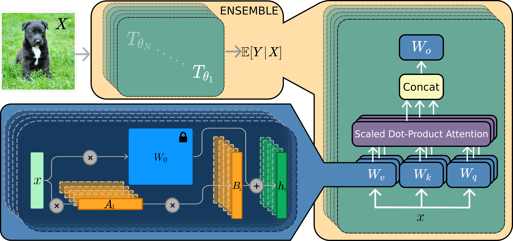

# LoRA-Ensemble: Efficient Uncertainty Modelling for Self-attention Networks
Michelle Halbheer, Dominik J. Mühlematter, Alexander Becker, Dominik Narnhofer, Helge Aasen, Konrad Schindler and Mehmet Ozgur Turkoglu - 2024

[[Paper on ArXiv]](https://arxiv.org/abs/2405.14438)
## Abstract
Numerous crucial tasks in real-world decision-making rely on machine learning algorithms with calibrated uncertainty estimates. However, modern methods often yield overconfident and uncalibrated predictions. Various approaches involve training an ensemble of separate models to quantify the uncertainty related to the model itself, known as epistemic uncertainty. In an explicit implementation, the ensemble approach has high computational cost and high memory requirements. This particular challenge is evident in state-of-the-art neural networks such as transformers, where even a single network is already demanding in terms of compute and memory. Consequently, efforts are made to emulate the ensemble model without actually instantiating separate ensemble members, referred to as implicit ensembling. We introduce LoRA-Ensemble, a parameter-efficient deep ensemble method for self-attention networks, which is based on Low-Rank Adaptation (LoRA). Initially developed for efficient LLM fine-tuning, we extend LoRA to an implicit ensembling approach. By employing a single pre-trained self-attention network with weights shared across all members, we train member-specific low-rank matrices for the attention projections. Our method exhibits superior calibration compared to explicit ensembles and achieves similar or better accuracy across various prediction tasks and datasets.

## Citation
If you find our work useful or interesting or use our code, please cite our paper as follows
```latex
@misc{
  title = {LoRA-Ensemble: Efficient Uncertainty Modelling for Self-attention Networks},
  author = {Halbheer, Michelle and M\"uhlematter, Dominik J. and Becker, Alexander and Narnhofer, Dominik and Aasen, Helge and Schindler, Konrad and Turkoglu, Mehmet Ozgur}
  year = {2024}
  note = {arXiv:2405.14438

}
}
```

## Overview
<p align="center"></p>


The LoRA technique allows for the use of a pre-trained model and fine-tuning it without the need to retrain all its parameters. This is particularly beneficial for modern neural networks with large parameter spaces. The technique involves freezing the pre-trained model weights and instead constraining the updates to a low-rank decomposition. This can be expressed mathematically as follows: 

$W = W_0 + BA = W_0 + \Delta W.$


Here $B\in R^{k\times r}$ and $A\in R^{r\times d}$ are two trainable low-rank matrices, where $r\ll\min(d,k)$. $W$ and $\Delta W$ are then multiplied with the same input, which yields the following modified forward pass:

$h = W_0 x + \Delta W x = W_0 x + BA x.$

The above is usually applied to Transformer models in the self-attention module. It contains four weight matrices: $W_q$, $W_k$, and $W_v$, which are the weights applied to generate the query, key, and value. $W_o$ is the weight matrix for the output. (Hu et al., 2021)

This same concept can be used to implement a deep ensemble with a shared backbone. This means we use a single, pre-trained model with its parameters frozen, meaning it does not take gradient updates. Separate update matrices $\Delta W_i$ are added for each ensemble member, where $i$ indicates the ensemble member. This gives us the modified forward pass for member $i$ as:

$h_i = W_0 x + \Delta W_i = W_0 x + B_i A_i x$


## Getting Started
Step 1: Clone or download this repository and set it as the working directory, create a virtual environment and install the dependencies.

```
cd LoRA-Ensemble/ 
python3 -m venv venv
source venv/bin/activate
pip install -r requirements.txt 
```
  
Step 2: To either train or evaluate the model, use the settings JSON file.

```
python main.py <settings_file>.json <model_name> <num_ensemble_members> <pretrained_model_name_for_evaluation>
```

**Parameters:**\
`settings_file`: Name of JSON file which contains settings about the model, data, training, and evaluation\
`model_name`:  Name of model. \
`num_ensemble_members`:  Number of ensemble members. \
`pretrained_model_name_for_evaluation`: Optional, name of pre-trained model. If given, the model will only be evaluated but not trained. 

Currently, the following models are supported (`model_name` in brackets): \
\
**Vision Transformer (ViT):**\
LoRA-Ensemble (LoRA_Former)\
Explicit Ensemble (Deep_Ensemble)\
Monte Carlo Ensemble based on Dropkey (MCDropout)\
\
**Audio Spectrogram Transformer (AST):**\
LoRA-Ensemble (AST_Former)\
Explicit Ensemble (Explicit_AST)\
Monte Carlo Ensemble based on Dropkey (ASTMCDropout)

Example: Training a LoRA-Ensemble model with 4 members, based on CIFAR100_settings_LoRA1

```
python main.py CIFAR100_settings_LoRA1.json LoRA_Former 4 
```

Example: Evaluate a LoRA-Ensemble model with 4 members, based on CIFAR100_settings_LoRA1 and the pre-trained weights LoRA_Former_ViT_base_32_4_members_CIFAR100_settings_LoRA1.pt

```
python main.py CIFAR100_settings_LoRA1.json LoRA_Former 4 LoRA_Former_ViT_base_32_4_members_CIFAR100_settings_LoRA1
```

 
## CIFAR-100
The table below shows the evaluation results obtained using different methods. Each method was trained five times with varying random seeds.

| Method (ViT)         | Accuracy  | ECE                         | Settings name*              | Model weights                                                       |
|----------------------|------------------------|-----------------------------|-----------------------------|---------------------------------------------------------------------|
| Single Network       | $76.6\pm0.2$           | $0.144\pm0.001$             | CIFAR100_settings_explicit  | Deep_Ensemble_ViT_base_32_1_members_CIFAR100_settings_explicit1.pt  |
| Single Network with LoRA | $79.6\pm0.2$      | $\textbf{0.014}\pm0.003$    | CIFAR100_settings_LoRA      | LoRA_Former_ViT_base_32_1_members_CIFAR100_settings_LoRA1.pt        |
| MC Dropout           | $77.1\pm0.5$           | $0.055\pm0.002$             | CIFAR100_settings_MCDropout | MCDropout_ViT_base_32_16_members_CIFAR100_settings_MCDropout1.pt    |
 | Snapshot Ensemble    | $77.0\pm0.1$         | $0.123\pm0.002$              | CIFAR100_settings_Snapshot  | Deep_Ensemble_ViT_base_32_16_members_CIFAR100_settings_Snapshot1.pt | 
| Explicit Ensemble    | $\underline{79.8}\pm0.2$ | $0.098\pm0.001$             | CIFAR100_settings_explicit  | Deep_Ensemble_ViT_base_32_16_members_CIFAR100_settings_explicit1.pt |
| LoRA-Ensemble        | $\textbf{82.5}\pm0.1$ | $\underline{0.035}\pm0.001$ | CIFAR100_settings_LoRA      | LoRA_Former_ViT_base_32_16_members_CIFAR100_settings_LoRA1.pt       |

\* Settings name is followed by a number in the range 1-5 indicating the used random seed.

## HAM10000
The table below shows the evaluation results obtained using different methods. Each method was trained five times with varying random seeds. 

| Method (ViT)               | Accuracy| ECE  | Settings name*     | Model weights |
|----------------------|------------------------|-----------------------|-------------------|------------------------------|
| Single Network       | $84.3\pm0.5$           | $0.136\pm0.006$       |HAM10000_settings_explicit|Deep_Ensemble_ViT_base_32_1_members_HAM10000_settings_explicit1.pt|
| Single Network with LoRA | $83.2\pm0.7$      | $0.085\pm0.004$       |HAM10000_settings_LoRA|LoRA_Former_ViT_base_32_1_members_HAM10000_settings_LoRA1.pt|
| MC Dropout           | $83.7\pm0.4$           | $0.099\pm0.007$ |HAM10000_settings_MCDropout|MCDropout_ViT_base_32_16_members_HAM10000_settings_MCDropout1.pt|
| Explicit Ensemble    | $\underline{85.7}\pm0.3$ | $0.106\pm0.002$     |HAM10000_settings_explicit|Deep_Ensemble_ViT_base_32_16_members_HAM10000_settings_explicit1.pt|
| Snapshot Ensemble    | $84.9\pm0.3$         | $\underline{0.058}\pm0.004$ |HAM10000_settings_Snapshot|Deep_Ensemble_ViT_base_32_16_members_HAM10000_settings_Snapshot1.pt|
| LoRA-Ensemble        | $\textbf{88.0}\pm0.2$ | $\textbf{0.037}\pm0.002$ |HAM10000_settings_LoRA|LoRA_Former_ViT_base_32_16_members_HAM10000_settings_LoRA1.pt|

\* Settings name is followed by a number in the range 1-5 indicating the used random seed.


## ESC-50
| Method (AST)               | Accuracy | ECE | Settings name*     |
|----------------------|------------------------|-----------------------|-------------------|
| Single Network       | $89.3\pm0.7$           | $0.040\pm0.005$       | ESC50_settings_explicit|
| Single Network with LoRA | $88.1\pm0.1$      | $0.039\pm0.002$       |ESC50_settings_LoRA|
| MC Dropout    |$89.4\pm0.3$      | $0.087\pm0.003$|ESC50_settings_MCDropout|
| Explicit Ensemble    | $\textbf{91.3}\pm0.3$ | $\underline{0.026}\pm0.003$ |ESC50_settings_explicit|
| LoRA-Ensemble        | $\underline{91.0}\pm0.2$ | $\textbf{0.022}\pm0.003$ |ESC50_settings_LoRA|

\* Settings name is followed by a number in the range 1-5 indicating the used random seed.

## Pre-trained Models
The models for our final results on the CIFAR-100 and HAM10000 datasets are published on [Hugging Face](https://huggingface.co/prs-eth/LoRA-Ensemble). You can download any of the models from there to quickly reproduce the presented results. The pre-trained models for ESC-50 cannot be released at this point, as it would require storing 5 full sized models per epoch, which is infeasible given our infrastructure.

# Further Studies

### More Experiments & Results
We also calculated F1, NLL, and Brier scores for our models in addition to Accuracy and ECE. These experiments were conducted using the following settings names (a number between 1-5 needs to be added at the end to specify the random seed):

**CIFAR-10:**

Explicit Ensemble: CIFAR10_settings_explicitScores \
MC Dropout: CIFAR10_settings_MCDropoutScores \
LoRA-Ensemble: CIFAR10_settings_LoRAScores 

**CIFAR-100:**

Explicit Ensemble: CIFAR100_settings_explicitScores \
MC Dropout: CIFAR100_settings_MCDropoutScores \
LoRA-Ensemble: CIFAR100_settings_LoRAScores 

**HAM10000:**

Explicit Ensemble: HAM10000_settings_explicitScores \
MC Dropout: HAM10000_settings_MCDropoutScores \
LoRA-Ensemble: HAM10000_settings_LoRAScores 

### Sensitivity Analysis: LoRA Rank
By varying the rank of the low-rank decomposition in LoRA the size of the model can be modulated. We looked into the effect of rank on predictive accuracy and uncertainty calibration for LoRA-Ensemble. These experiments were conducted using the following settings names:

**CIFAR-100:**

Rank 1: CIFAR100_settings_rank1 \
Rank 2: CIFAR100_settings_rank2 \
Rank 4: CIFAR100_settings_rank3 \
Rank 8: CIFAR100_settings_rank4 \
Rank 16: CIFAR100_settings_rank5 \
Rank 32: CIFAR100_settings_rank6 

**HAM10000:**

Rank 1: HAM10000_settings_rank1 \
Rank 2: HAM10000_settings_rank2 \
Rank 4: HAM10000_settings_rank3 \
Rank 8: HAM10000_settings_rank4 \
Rank 16: HAM10000_settings_rank5 \
Rank 32: HAM10000_settings_rank6 

### Validation of our AST Implementation
The Audio Spectrogram Transformer (AST) model provided by Gong et al. (2021) was copied without any changes. However, the training and evaluation pipeline was adapted to fit our architecture. Correspondingly, it was essential to validate the equivalence of our implementation by training a single AST on the ESC50 dataset. These experiments were conducted using the following settings names: 

AST-S: ESC50_settingsPaperImageNet_experiment1 \
AST-P: ESC50_settingsPaper_experiment1

### Initialization of LoRA Parameters
Randomness in initialization is a primary driver of diversity in ensemble members. Therefore, finding the right balance between diversity and overly disrupting parameters is of high importance. In our experiments, we always set B to be zero initially while varying the parameters and method for initializing A. These experiments were conducted using the following settings names: 

**Gaussian (mean = 0)** \
Std. 0.02: CIFAR100_settings_experiment1 \
Std. 0.05: CIFAR100_settings_experiment2 \
Std. 0.1: CIFAR100_settings_experiment3 \
Std. 0.2: CIFAR100_settings_experiment4 \
Std. 0.5: CIFAR100_settings_experiment5 \
Std. 1: CIFAR100_settings_experiment6 \
Std. 2: CIFAR100_settings_experiment12

**Xavier Uniform** \
Gain 1: CIFAR100_settings_experiment7 \
Gain 5: CIFAR100_settings_experiment8 \
Gain 10: CIFAR100_settings_experiment9 \
Gain 15: CIFAR100_settings_experiment10 \
Gain 20: CIFAR100_settings_experiment15 \
Gain 30: CIFAR100_settings_experiment16

### Initialization of Explicit Ensemble Parameters
The explicit ensemble has a limitation: except for the last layer, all parameters are initialized equally across the members when using transfer learning, and the same backbone is used for each member. Therefore, we studied the effect of adding additional noise to the parameters to increase variability across the members. This was done using the following formula:

$W_{\mathrm{new}} = W + \alpha \cdot dW$

where $dW \sim \mathcal{N}(0,\sigma_W)$. Here $\alpha$ is a scale factor to control the amount of noise and $\sigma_W$ is the standard deviation of the parameter matrix. This was applied to all weight matrices separately. These experiments were conducted using the following settings names: 

CIFAR100_settings_max< Number Layers >noise< $\alpha$ id >.json

Where < Number Layers > refers to the number of layers to which the method is applied, ranging from 1 to 12. A value of 1 indicates that the method is applied only to the last layer of the network, while a value of 5 indicates that the method is applied to the last 5 layers of the network. < $\alpha$ id > refers to the ID of the $\alpha$, as follows:

$\alpha$ = 1: 1\
$\alpha$ = 0.1: 2\
$\alpha$ = 0.01: 3\
$\alpha$ = 0.001: 4\
$\alpha$ = 0.0001: 5


### Hyperparameter Tuning for AST Experiments
The original training settings of the AST-S model by Gong et al. (2021) utilized a batch size of 48. However, due to single GPU training on Nvidia A100 with 80 GB memory constraints, replicating a batch size of 48 as in the original AST-S publication was unfeasible for training an explicit AST-S ensemble with 8 members. Consequently, we performed minimal hyperparameter tuning by employing a batch size of 1 for both the explicit AST-S and the LoRA AST-S model, exploring various learning rates. Apart from batch size and learning rate adjustments, all other settings remained consistent with Gong et al. (2021). These experiments were conducted using the following settings names:

**Explicit AST** \
Learning rate 0.00001: ESC50_settingsExplicit_experiment1\
Learning rate 0.00005: ESC50_settingsExplicit_experiment2

**LoRA AST** \
Learning rate 0.00001: ESC50_settingsExplicit_experiment5\
Learning rate 0.00005: ESC50_settingsExplicit_experiment1\
Learning rate 0.0001: ESC50_settingsExplicit_experiment2\
Learning rate 0.0005: ESC50_settingsExplicit_experiment3\
Learning rate 0.001: ESC50_settingsExplicit_experiment4


### Hyperparameter Tuning for MC Dropout
We conducted an analysis to determine the impact of dropout probability (p) on the accuracy and calibration of the ViT with Monte Carlo dropout. These experiments were conducted using the following settings names:

p 0.1: HAM10000_settings_MCDropoutRate1 \
p 0.2: HAM10000_settings_MCDropoutRate2 \
p 0.3: HAM10000_settings_MCDropoutRate3 \
p 0.4: HAM10000_settings_MCDropoutRate4 \
p 0.5: HAM10000_settings_MCDropoutRate5  


# References
Y. Gong, Y. A. Chung, and J. Glass. AST: Audio Spectrogram Transformer. In Annual Conference of the International Speech Communication Association, 2021.</br>
E. Hu, Y. Shen, P. Wallis, Z. Allen-Zhu, Y. Li, S. Wang, L. Wang, and W. Chen. LoRA: Low-Rank Adaptation of Large Language Models. In 10th International Conference on Learning Representations, 2021.
